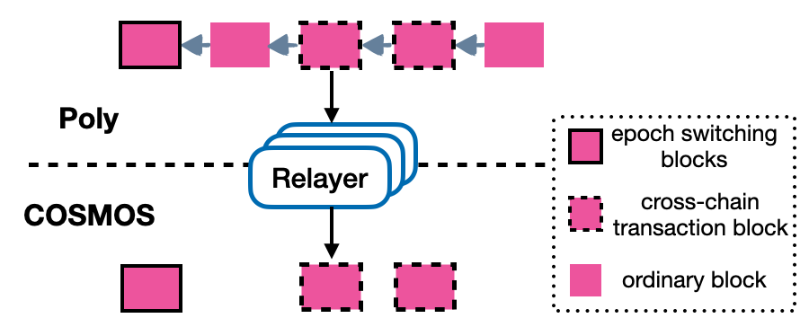
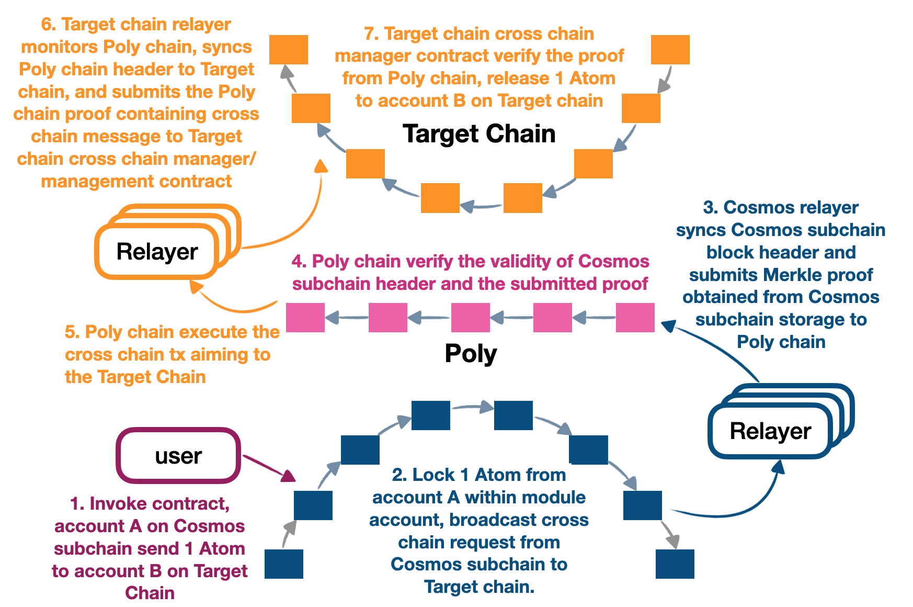

<h1 align="center">Cosmos跨链生态</h1>
<h4 align="center">Version 1.0 </h4>

English | [中文](README_CN.md)

## Introduction
Cosmos-sdk is the first modularized sdk for constructing the public blockchain. Different from supporting smart contract with EVM in Ethereum， We can focus on the logic in business level and implement much more complex and complicated decentralized applications utilizing Cosmos-sdk, rather than considering if the logic and operation are compatible with the underlying virtual machine. Recently, the IBC module of interoperability proposed by cosmos core developers has attracted more attention, which aims to connect different cosmos subchains to the cosmos hub and achieve the interoperability between them. 

However, the protocol is not mature enough and still under development, besides, the IBC protocol will not support heterogeneous chain interoperability. To solve these two problem, PolyChain provides a solution, connecting any cosmos subchain to any other public chains, either other cosmos subchains or heterogeneous chains like BTC, Ethereum, Neo, Ontology and so on supported by PolyChain.

Now Let us take a look at how it works.

## Framework

As shown in the above figure, the cross chain framework within Polynetwork consists of the comsos subchain, the cosmos relayer, PolyChain, the target chain relayer, and target chain. Simply put, the user can invoke and request `Lock` within `ccm` module, lock the state or the tokens within the cosmos subchain, the cross chain proof (containing cross chain message) will be relayed to the PolyChain through the cosmos relayer. Then the PolyChain will verify the cross chain proof originated from cosmos and parse the verified message, produce the proof in PolyChain and emit it out. The target chain relayer will monitor PolyChain event and recognize which proof is for target chain, after which it will submit PolyChain header and proof to the cross chain manager component of target chain. The target chain will be able to verify, execute the cross chain message. Till now, the cross chain flow is completed from cosmos subchain to other public chains like BTC, Ethereum, Ontology and so on.

The components involved in this process:
- [PolyChain](./../poly/side_chain_management.md): PolyChain is one of the crucial components of the cross chain ecosystem，Each different type of node that is deployed and maintained by different individuals or organizations and has its unique governance and trust mechanism. The relay chain is responsible for connecting them, standardizing cross chain data flow and interfaces, and verifying the legitimacy of cross chain data, etc.
- [Cosmos Relayer](cosmos_relayer.md)：Each chain in the cross chain ecosystem has a relayer associated to it that is responsible for monitoring the transactions taking place on the relay chain and then transferring them to the respective target chain, and vice versa. Thus they act as the medium of interaction between Ethereum and the outside world. Relayers collect small incentives carrying out the above stated tasks.
- [Cosmos subchain](https://github.com/polynetwork/gaia-demo.git)：Any Cosmos subchain integrated with [cosmos-poly-module](https://github.com/polynetwork/cosmos-poly-module.git) module can send cross chain request to any other target block chains only if it is supported by PolyChain. The developers can simply import and use these modules directly.

## Background

### Cosmos Light Client Protocol

Light client only needs to synchronize the block header and validator set and their commitment or signature.

Suppose there is a reliable initial block header with valid validator set and their commitment, the light client needs to verify if the subsequent block headers are reliable based on the initial block header.

### State Proof of Cosmos

#### Merkle Tree

There are two types within simple merkle tree, leaf nodes and internal nodes. The hash of former is SHA256(0x00 || leaf_data), the hash of internal node is SHA256(0x01 || left_hash || right_hash).

All the state data can be hashed based on the above rule, we can obtain a root hash called merkle root. We can use merkle proof of a leaf node and merkle root to verify if the state data is correct.

#### IAVL Tree

The state data within cosmos are stored through IAVL tree. TAVL tree is derived from AVL tree, Just like AVL tree, it's also a balanced binary search tree. Every node, including leaf node and internal node has its own key. However, different from AVL tree, the key of internal node is the key of its right child.

The root hash is computed just as the merkle tree and the root node is the root of the state tree, similarly, the root hash is the state root of state tree. The merkle proof of a leaf node and merkle root can be used to verify if the state data is correct.

## The Principle

The light client protocol is implemented in the PolyChain to ensure the cosmos headers are verifiable and reliable.

The reliable cosmos subchain header contains the state root of current block. When the cosmos relayer submits the cross chain message, its proof in the state tree of cosmos subchain, and the reliable state root, the cross chain message can be verified.

### Synchronizing Cosmos Block Headers on the PolyChain

To synchronize block headers from Cosmos subchain to the PolyChain you first need to specify an initial block header from where the synchronization starts. The initial block header and the consequent block headers will be synchronized on the Poly chain.
The header of block that does not contain cross chain transaction still needs to be synchronized to the PolyChain in order to prevent the previous validator set forge the block header and proof.

### Synchronizing Poly Chain Block Headers on Cosmos subchain

Synchronizing Poly chain block headers on Cosmos subchain also occurs in a similar manner. An initial block header is selected from where the synchronization process begins, and all the subsequent blocks are synchronized. The initial block header should include the information of switching consensus nodes, from which height, the cross chain transaction from or to Cosmos subchain will be effective.

There is no need to synchronize all the Poly chain block header to Cosmos subchain only the block header that contains cross chain message to Cosmos subchain or contains the information of switching consensus nodes needs Synchronizing. 

Poly chain headers synchronized on Cosmos subchain:

### Transactions from Cosmos subchain to Poly Chain

The process consists of locking user token, submitting Cosmos subchain block header and message proof to the Poly chain by the cosmos relayer.
- User send the `MsgLock` request handled by different modules within `cosmos-poly-module`. The tokens are locked in the module account or burnt out, then cross chain message is stored.
- Cosmos relayer monitors and graps the event emitted out from `cosmos-poly-module.ccm` (`cross chain manager`). The relayer will submit the message proof obtained from Cosmos storage and correlated cosmos subchain header to Poly chain. PolyChain will be able to verify the cross chain message, and emit out another proof produced by Poly chain, which aims to be utilized by the target chain cross chain manager to verify the Poly chain message.

Cosmos subchain to Poly chain transactions:

### Transactions from Poly Chain to Cosmos subchain

Sending a transaction from the Poly chain to Cosmos subchain is much like the opposite and involves submitting the Poly chain block headers and cross chain message merkle proof produced by Poly chain.

- The cosmos relayer needs submitting the Poly chain block headers to the Cosmos subchain through the `cosmos-poly-module.ccm` (`cross chain manager`) or `cosmos-poly-module.headersync` module. Either way, the Poly chain block headers are maintained in Cosmos subchain.
- The relayer listens to the cross chain manager contract on the Poly chain, fetches the Poly chain cross chain events, and submits the cross chain proof obtained based on the cross chain message from events to Cosmos subchain through `ccm.ProcessCrosschainTx`(`cross chain manager`) within `cosmos-poly-module`. Finally, the `ccm` module will invoke the corresponding module's `Unlock` method to release the user's locked tokens to the receiver account.

## Cosmos Cross Chain Transaction

The process flow of cross chain transaction from Cosmos to other chains:

1. The user sends a cross chain transaction from Cosmos subchain that, for instance, transfer 1` Atom from account A on Cosmos subchain to account B on the target chain
   
2. The user needs to send `lockproxy.MsgLock` message to the Cosmos subchain, transferring 1 Atom from user to the module account and locking in the module account. Then the cross chain event will be emitted out
   
3. The cosmos relayer will always synchronize Cosmos subchain block header to Poly chain, meanwhile, the relayer also monitor the cross chain event emitted from `ccm`(`cross chain manager`) module. Once there appears a new cross chain event, the relayer will get the cross chain message proof from the Cosmos subchain storage and the header containing state root able to verify the proof

4. The relayer will construct Poly chain tx and submit the proof and Cosmos subchain header to Poly chain. The functionality of this tx is to process cross chain proof and parse the cross chain message along with Synchronizing the Cosmos subchain header on Poly chain

5. If the transaction is valid, the relay chain generates a transaction to be sent to the target chain, along with the transaction's merkle proof

6. The target chain relayer monitors the transactions on the relay chain and looks out for the transactions that need to be transferred to the target chain. It syncs the block header to the target chain and sends the transaction and the corresponding merkle proof along with it.

7. When the target chain confirms the transaction's legitimacy, the target chain executes a final transaction that sends the 1 Atom to account B.

Through the above explanation, we should know the flow of cross chain between Cosmos subchain and other public chains, then let us give it a try to send cross chain transactions! [Cosmos subchain cross chain handbook](how_to_cross_on_cosmos.md)

## License
The Poly Network library is licensed under the GNU Lesser General Public License v3.0. Please refer to the LICENSE file in the root directory of the project for details.

