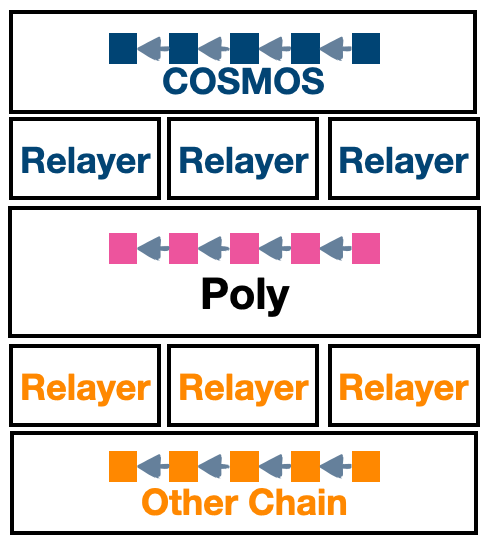
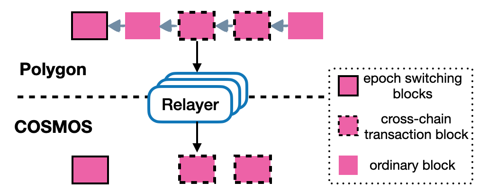
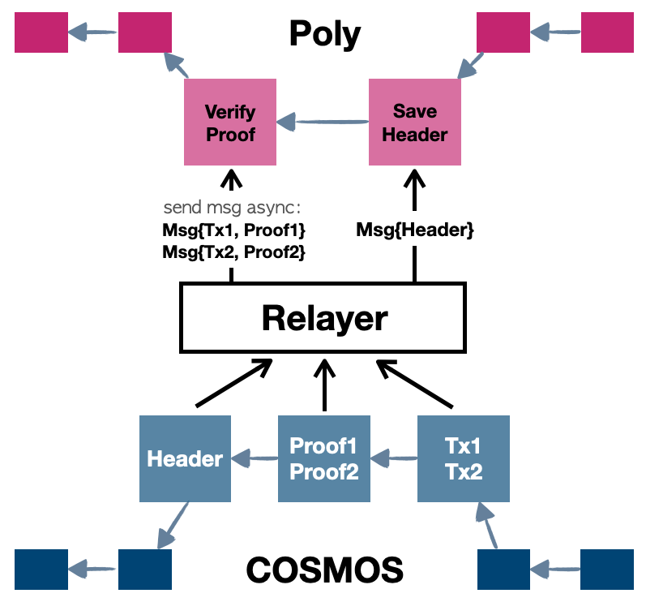
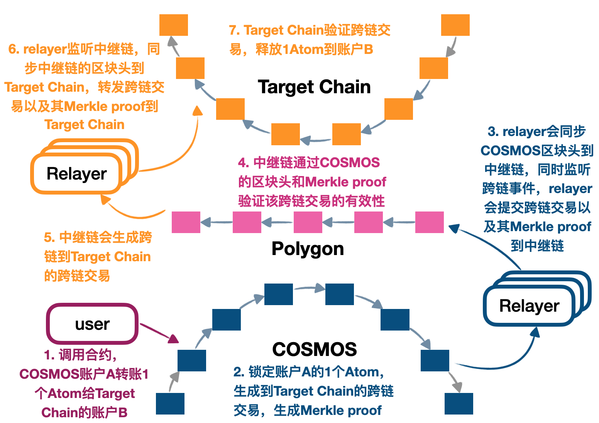

<h1 align="center">Cosmos跨链生态</h1>
<h4 align="center">Version 1.0 </h4>

[English](README.md) | 中文

## 引言
Cosmos-sdk是首个将区块链架构模块化的公有链。与以太坊上的运行在EVM的智能合约不同的是，Cosmos极大地方便了一些业务逻辑较为复杂或计算较为繁琐的区块链应用，使开发者只需关注应用层的业务逻辑。同时，Cosmos的跨链模块(IBC)也是大家比较关注的方面，其宗旨是通过Cosmos-Hub连接不同的Cosmos子链，并实现不同子链的相互通信，但当前Cosmos子链间的通信尚未成熟且不能支持与Cosmos生态外的区块链进行可靠通信，因此，我们提供了一个方案，能够把Cosmos网络上任一子链通过中继链跳转到其他任何接入中继链生态的公有链。接下来，就让我们一起了解一下是如何实现的。

## 架构

如上图所示的Cosmos跨链生态架构，从上到下依次为Cosmos任一子链、Cosmos Relayer、中继链、目标链Relayer、目标链。简单来说，用户通过调用Cosmos子链里<code>crosschain</code>模块的跨链请求<code>(Lock)</code>，将状态或代币在Cosmos子链上进行锁定，其执行结果将通过Cosmos Relayer被传递到到中继链，中继链将对执行结果进行验证并生成证明，然后再由目标链Relayer将中继链生成的证明传递到目标链，目标链对通过解析证明、执行跨链信息。至此，即完成了Cosmos子链到其他链如比特币、以太坊、本体链等的跨链交易。

生态中的角色：
- [**中继链**](https://github.com/ontio/cross-chain/blob/master/orchain/How_to_join_cross_chain_cn.md)：中继链是整个生态中的重要部分，每个节点由不同的个人或组织运行，有自己独特的治理模式和信任机制，它负责将各个链连接到一起，实现了跨链信息统一、跨链接口标准化、跨链信息合法性验证等功能；
- [**Cosmos Relayer**]()：每条链都有自己的Relayer，它们负责搬运中继链和Cosmos链之间的跨链信息，是中继链和Cosmos链之间的通信兵；
- [**Cosmos子链**](https://github.com/ontio/cross-chain/blob/master/eth/ethereum_relayer_manual_CN.md)：任意集成了<code>crosschain</code>模块的Cosmos子链都可以通过发送跨链请求实现Cosmos子链到其他任意目标链的跨链功能。

## 背景

### Cosmos轻客户端协议

轻客户端只需要同步区块链轻量的区块头信息，并且只需要最少的处理来安全的验证区块最近的状态，协议主要包括验证者集合和带签名的可信区块头。

假定轻客户端有一个安全可信的初始区块头inithead，基于该初始区块头，轻客户端需要验证后续其他的区块头newhead是否可信。

### Cosmos的State Proof

#### Merkle Tree

Simple Merkle Tree有两类节点，叶子节点和内部节点，叶子节点的hash为SHA256(0x00 || leaf_data),内部节点的hash为SHA256(0x01 || left_hash || right_hash)。

将状态数据按照上述节点组织起来，最后会得到一个根节点为Merkle Root。

要验证某一个叶子节点上的状态数据，只需要其Merkle Proof Path和Merle Root，就可以证明叶子节点是否包含了指定的状态数据。

#### IAVL Tree

cosmos的状态存储采用的IAVL Tree。

IAVL Tree是AVL Tree的变种，和AVL Tree一样，它是平衡二叉搜索树，每个节点，包括叶子节点和内部节点都有Key，但和AVL Tree不一样的是，IAVL Tree内部节点的key是其右孩子的key。

IAVL Tree的hash计算和Merkle Tree一样，其根节点即为状态树的root，根节点hash为整个状态的state root。

要验证某个叶子节点上的状态数据，需要其Proof Path和State Root，就可以证明叶子节点是否包含指定的状态数据。

## 原理

在中继链运行有cosmos轻客户端协议，可以确保安全的cosmos区块头。

安全的cosmos区块头中包含有当前block的State Root。提交在cosmos上发生的跨链交易的data、该data在cosmos状态树中的Proof，集合安全可信的State Root可以验证data的有效性，从而证明cosmos上发生的跨链交易。

### Cosmos链区块头同步到中继链
TODO

### 中继链区块头同步到Cosmos链

中继链区块头同步到Cosmos链需要首先指定一个中继链初始区块头，从这个区块头开始同步中继链区块头，包括同步初始区块头和同步区块头。

中继链区块头同步到Cosmos链：

中继链区块头同步到Cosmos子链，不需要一个一个区块头地连续同步，只有需要区块头才被同步。什么是需要的区块头呢？有发生验证节点变更的区块头和包含跨链到Cosmos子链交易的区块头，需要同步到Cosmos子链。因为中继链是具备即时终局性的区块链。

### 从Cosmos跨链到中继链
TODO

Cosmos子链跨链到中继链：

### 从中继链跨链到Cosmos链

反向与正向类似，依然可以分为区块头和merkle proof提交两部分：

- Relayer会把中继链的区块头提交到Cosmos子链<code>crosschain</code>模块，该模块维护了中继链的区块头；
- Relayer监听中继链跨链管理合约，捕捉到Cosmos子链的跨链事件，提交跨链事件以及中继链的Merkle proof到Cosmos子链，然后<code>crosschain</code>模块中的<code>processCrosschainTx</code>函数会用中继链的区块头验证Merkle proof，然后执行<code>unlock</code>逻辑将跨链资产从<code>crosschain</code>的模块帐户解锁给用户。

## Cosmos跨链工作流程

Cosmos子链跨链到目标链的工作流程：

1. 用户发送跨链交易到Cosmos子链，如Cosmos子链上的账户A通过调用<code>crosschain</code>模块的<code>Lock</code>发起跨链请求，想将1个Atom给Target Chain的账户B；

2. Comsos子链上<code>crosschain</code>模块的<code>Lock</code>函数链会将1个Atom从账户A中转入<code>crosschain</code>模块帐户中，并生成跨链到Target Chain的跨链消息和Proof；

3. Cosmos Relayer会一直同步Cosmos子链区块头到中继链，同时一直在监听<code>crosschain</code>模块生成的跨链事件，在Cosmos子链生成了跨链消息后，TODO: check: Relayer会将该跨链消息构造成发送到中继链的跨链交易并且其中包含了证明该消息有效的MPT Proof发送到中继链；

4. 中继链有以太的区块头信息和以太跨链交易的MPT Proof，可以验证该跨链交易的有效性；

5. 如果验证有效，那么中继链会生成证明该跨链交易有效的Merkle Proof；

6. Target Chain的Relayer一直监听中继链上的跨链消息，一但有，则Relayer会同步中继链的区块头和Merkle Proof到Target Chain；

7. Target Chain验证跨链交易，如果有效，则执行交易，如释放1Atom到账户B

通过以上的介绍大家应该已经基本了解了以太坊跨链的流程，接下来，让我们一起动手试试如果实现在以太坊链上的跨链吧！[Cosmos跨链操作手册](how_to_cross_on_cosmos_CN.md)
## 许可证

Poly Network遵守GNU Lesser General Public License, 版本3.0。 详细信息请查看项目根目录下的LICENSE文件。
