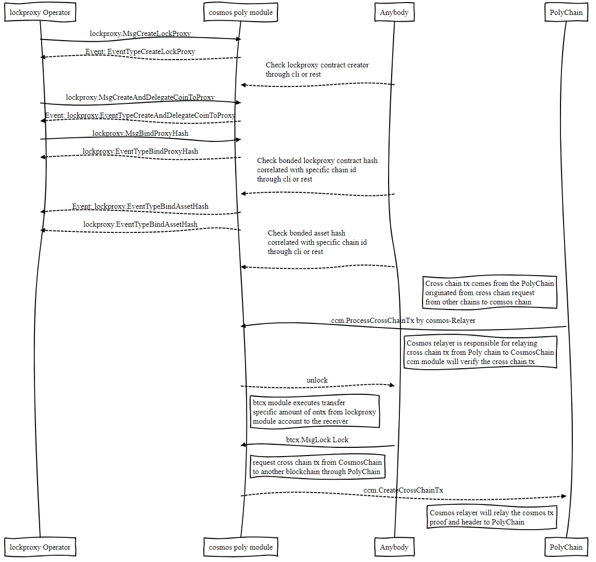

<h1 align="center">跨链流程说明</h1>
<h4 align="center">Version 1.0 </h4>

[English](cosmos_cross_chain_workflow.md) | 中文
## 跨链介绍

跨链，一句话就是将链A上某帐户的资产转移到链B上某帐户上。通过Poly Chain进行跨链资产转移，不仅支持同构链资产跨链也能实现异构链跨链资产转移。接下来我们介绍一下通过Poly Chain跨链过程中的一些概念。

#### 源链和目标链：
源链和目标链是相对于某一种跨链资产来讲的概念。源链指某资产初始时出现在某一条链上，则该链为源链；相对的，目标链是指该资产将会被跨链转移到的另一条或几条链。举例来说：
```markdown
对于Ethereum链上Ether资产，Ether资产的源链为以太坊链，如果我们准备把Ether这种资产跨链转移到
某一条Cosmos子链，Ontology链或Neo链，则该Cosmos子链，Ontology链或Neo链就是该资产的目标链。

对于Ontology链上的某种OEP4资产，该OEP4资产的源链即为Ont，如果我们准备把该OEP4资产跨链转移到
Ethereum链或Cosmos子链，则Ethereum链或Cosmos子链则为该资产的目标链
```

#### Cosmos子链上的资产哈希

在Cosmos网络中，没有虚拟机，也就没有类似以太坊或本体链上的布署合约的概念，但我们提供的跨链模块是可以通过一些接口来发行一些代币来实现类似布署资产合约的功能。具体包括`btcx`模块的`MsgCreateCoin`接口，`ft`模块的`MsgCreateDenom`、和`MsgCreateCoins`接口和`lockproxy`模块中的`MsgCreateAndDelegateCoinToProxy`。

在介绍这些接口用法和区别之前，我们先说明一下Comsos子链中怎样做到不同代币的区分，其在以太坊链、本体链中的概念是指不同的资产合约具有不同的资产哈希。在Cosmos子链中每个帐户的所有资产余额是通过`Coins`来记录的，`Coins`即是`Coin`的数组，而`Coin`由两部分组成，`Coin.Denom`即资产名字是Cosmos子链中某一资产种类的唯一标识，`Coin.Amount`指明了某帐户中的该资产的余额。在跨链过程中，我们把`Coin.Denom`对应的的十六进制字节数组当作该种资产的资产哈希。

## Cosmos 跨链说明

首先说明一下不同创建代币接口的区别：

Which Interface used to create coin | Initial Supply | who has initial supply | Need `lockproxy` module  | Asset Hash | BindAssetHash | How to cross 
--------- | --- | ----------- | -------------- | ------- | ------- | ---------
`btcx.MsgCreateDenom`  | Zero | None |  No | [Hex format](https://github.com/polynetwork/cosmos-poly-module/blob/master/btcx/internal/keeper/keeper.go#L104) of `Denom` | `btcx.BindAssetHash`  | `btcx.MsgLock`
`lockproxy.MsgCreateAndDelegateCoinToProxy` | Non-Zero | `lockproxy` module | Yes  | Hex format of `Denom` | `lockproxy.BindAssetHash` | `lockproxy.MsgLock` 
`ft.MsgCreateDenom` | Zero | None | Yes  | Hex format of `Denom` | `ft.BindAssetHash` | `ft.MsgLock`
`ft.MsgCreateCoins` | Non-Zero | Coin Creator | `bank.MsgSend`  | Hex format of `Denom` | No need | No need 

关于每个接口的具体功能及使用场景：
- `btcx.MsgCreateCoin`: 该接口服务的资产类型是目标链资产，如Cosmos子链上的BTC资产，其功能为在Cosmos子链中创建一种资产，该资产的初始总量为零。
- `lockproxy.MsgCreateAndDelegateCoinToProxy`：是服务于`lockproxy`模块的，其功能为代建一种总量不为零的资产，并将所有的资产转移到`lockproxy`模块帐户中。为什么要转移进去呢？这是因为该资产将会作为目标链资产以后可以通过`lockproxy`的方式与源链资产的连通起来。
- `ft.MsgCreateDenom`：该接口存在的意义在于当源链资产不是通过`lockproxy`方式进行跨链转移资产的时候，我们可以在Cosmos子链中通过创建初始总量为零的代币，并通过调用`ft.MsgBindAssetHash`来对源链或其他目标链资产哈希进行映射。
- `ft.MsgCreateCoins`：该接口的应用场景为某用户希望在Cosmos子链中发行一种总量不为零的新资产，通过该接口创建出的资产可以不使用任何跨链模块中的其它接口，而是作为独立的资产存在，通过cosmos-sdk的内嵌模块进行资产的转移。

需要注意的是某一种资产如(mst)一旦被创建，就不能再次创建具有相同名字(mst)的资产，原因在于cosmos-sdk的supply模块会统一记录所有被新增资产。

## 创建跨链交易流程
* 对于想把类BTC资产跨链到Cosmos子链的操作流程
<div align=center></div>
#### 发送ONT到Cosmos子链
* 将ONT发送到Cosmos上面的的流程为
<div align=center></div>

## 许可证
Poly Network遵守GNU Lesser General Public License, 版本3.0。 详细信息请查看项目根目录下的LICENSE文件。