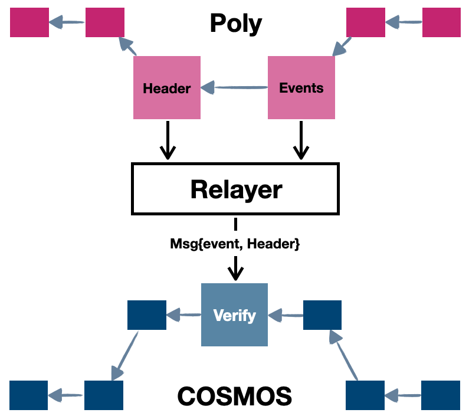

<h1 align="center">Cosmos Relayer</h1>
<h4 align="center">Version 1.0 </h4>

English | [中文](cosmos_relayer_CN.md)

## Introduction
When we want to cross the coins from Cosmos chain to other public chains, there should exist cosmos relayers running. It mainly complete two functionalities, which are submitting cross chain request from Cosmos subchain to Poly chain and submitting cross chain request from Poly chain to Cosmos subchain.

When the cross chain transaction is to Cosmos subchain, the cosmos relayer is responsible for monitoring event emitted our from Cosmos subchain cross chain manager and fetching the proof of cross chain transaction, then relayer needs to submit the proof and next block header containing the state root of proof to Poly chain. Then Poly chain can verify if the cross chain transaction is executed successfully in Cosmos subchain, and generate the Poly chain proof to indicate the cross chain request from Cosmos subchain is valid, the relative relayer responsible for relaying cross chain transaction to the relative public chain will submit the Poly chain proof along with next Poly chain block header to the relative public chain cross chain manager to process the transaction, either unlock tokens from `lockproxy` contract or mint tokens to the receiver.

The information relayed by the relayer includes cross chain transaction proof, and the Cosmos subchain block header (next block header of the cross chain transaction execution header) containing state root of transaction proof. The proof contains `toChainId`, `toAddress`, `amount`. `toChainId` means the target chainId in Poly chain, `toAddress` means the receiver address in bytes format on target chain, and `amount` means the crossed asset amount. Poly chain will first verify the Cosmos block header, then the application state root within Cosmos block header can help verify the validity of transaction proof (indicating the cross chain request are successfully executed on Cosmos chain), and obtain the actual cross chain transaction message. 

Similarly, the cosmos relayer also submits cross chain transaction from Poly chain to Cosmos subchain, the `cosmos-poly-module.ccm` module will verify and execute cross chain request.

## Framework

Cosmos relayer listens to cross chain event of each height, when there is cross chain transactions tx1 and tx2 in height h, the relayer will get proof from height H where H is higher than h. The proof originated from `ccm` module at height H, and Cosmos subchain block header of height H+1 will be submitted to Poly chain, Poly chain then will verify the validity of header of H+1, after which the proof will be verified and the cross chain message will be extracted to be processed on Poly chain.


<div align=center></div>

Similarly, Cosmos relayer also listens to the cross chain event from Poly chain, and submit the related proof and header to Cosmos subchain. The `ccm` module of Cosmos subchain will verify the Poly chain header and execute cross chain transaction, either mint coins to the receiver or transfer coins from `lockproxy` module account to the receiver. The difference currently lies in that Cosmos relayer needs to pay off the Cosmos subchain transaction fee. 

<div align=center></div>

## Usage

Downloading the relayer codes and build, then set up your configuration as the following.


```text
{
  "cosmos_rpc_addr": "http://ip:port", //Cosmos rpc address
  "cosmos_wallet": "/path/to/cosmos_key", // cosmos wallet exported through gaia client
  "cosmos_wallet_pwd": "pwd", // the password correlated with the above wallet account
  "cosmos_start_height": 0, // the height from which cosmos relayer begins to scan cosmos event
  "cosmos_listen_interval": 1, // the time interval of cosmos relayer scanning cosmos event 扫描间隔（秒）
  "cosmos_chain_id": "testing", // the chain id of Cosmos subchain
  "cosmos_gas_price": "0.00001stake", // the gas price of tx sending to Cosmos subchain
  "cosmos_gas": 200000, // the maximum gas of one Cosmos transaction

  "poly_rpc_addr": "http://172.168.3.73:40336", // Poly chain rpc address
  "poly_wallet": "wallet.dat", // Poly chain wallet path and name
  "poly_wallet_pwd": "pwd", // Poly chain wallet password
  "poly_start_height": 0, // the height from which cosmos relayer begins to scan Poly chain
  "poly_listen_interval": 1, // the time interval of cosmos relayer scanning Poly chain event
  "poly_to_cosmos_key": "makeProof", // cross chain event keywords from which Cosmos relayer obtain the proof from storage

  "db_path": "cosmos-relayer/db", // the database path maintained by the cosmos relayer
  "log_level": 2 // 0: TRACE, 1: DEBUG:, 2: INFO, 3: WARN, 4: ERROR
}
```
When we set up the configuration file, the Cosmos relayer is ready to run. If there is no password in the config file, we need to input password when we launch the cosmos relayer.
```go
go build -o run_cosmos_relayer cmd/run.go
./run_cosmos_relayer -conf=conf.json
```

## License

The Poly Network library is licensed under the GNU Lesser General Public License v3.0. Please refer to the LICENSE file in the root directory of the project for details.
